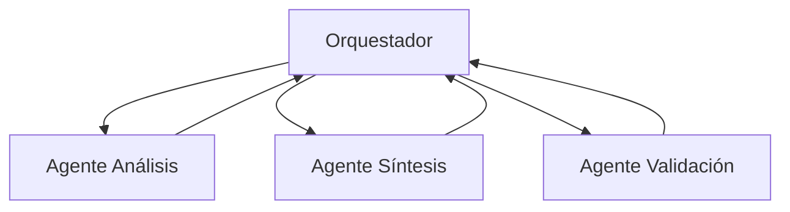
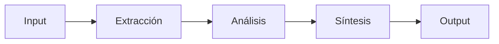
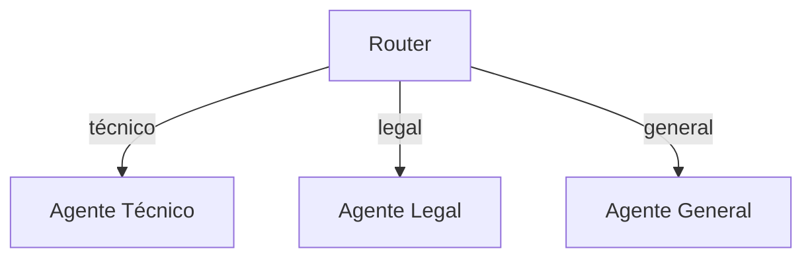

## Introducción

En sistemas multiagente, la orquestación de llamados a LLMs es crucial para coordinar la comunicación entre agentes y garantizar respuestas coherentes y eficientes.

## Patrones de Orquestación

### 1. Orquestador Central (Hub and Spoke)

Un agente central coordina todos los llamados y distribuye tareas a agentes especializados.

**Ventajas:**
- Control centralizado del flujo
- Fácil de debuggear
- Punto único de logging

**Desventajas:**
- Cuello de botella potencial
- Single point of failure

### 2. Pipeline Secuencial

Los agentes procesan la información en secuencia, cada uno añadiendo valor.

**Casos de uso:**
- Procesamiento de documentos
- Pipelines de ETL con IA
- Refinamiento iterativo de respuestas

### 3. Routing Dinámico

Un router decide qué agente debe manejar cada request basándose en el contenido.

## Estrategias de Manejo de Errores

### Retry con Backoff Exponencial

### Fallback a Modelo Alternativo

Si el modelo principal falla, usar uno de respaldo con capacidades similares.

## Consideraciones de Latencia

| Estrategia | Latencia | Costo | Complejidad |
|------------|----------|-------|-------------|
| Secuencial | Alta | Bajo | Baja |
| Paralelo | Baja | Alto | Media |
| Híbrido | Media | Medio | Alta |

## Recursos

- [LangGraph Documentation](https://langchain-ai.github.io/langgraph/)
- [Microsoft AutoGen](https://microsoft.github.io/autogen/)
- [CrewAI Framework](https://www.crewai.com/)
