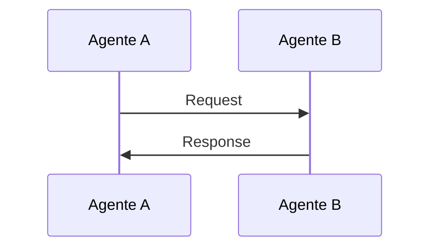
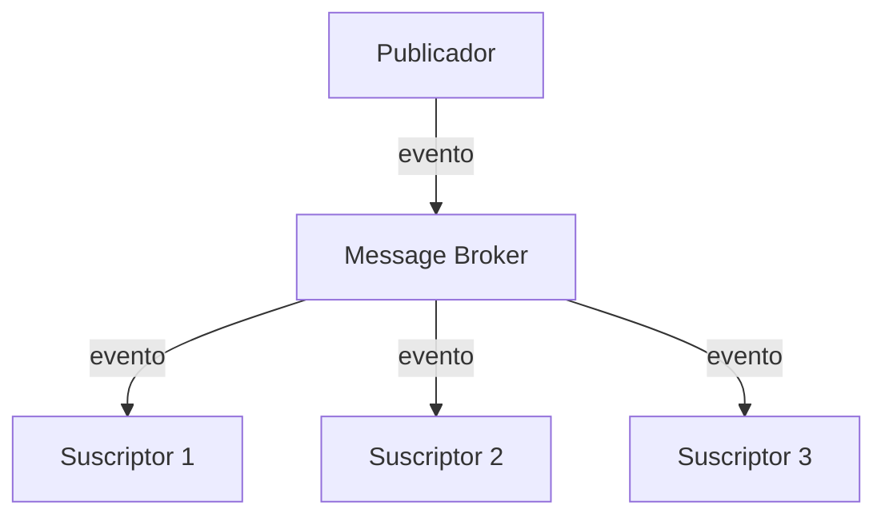
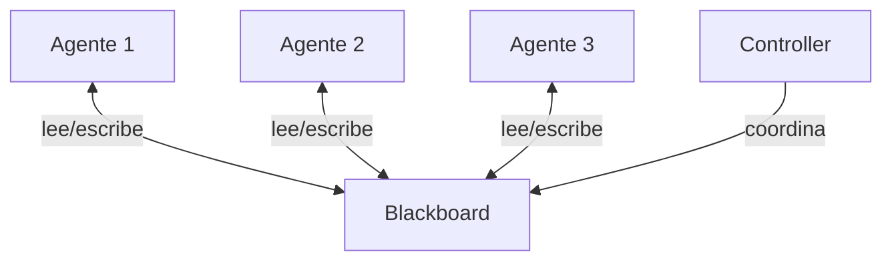

## Introducción

La comunicación entre agentes es fundamental para sistemas multiagente efectivos. Este documento explora los principales patrones utilizados en la industria.

## Patrones de Comunicación

### 1. Request-Response

El patrón más simple: un agente hace una pregunta y espera respuesta.

### 2. Pub/Sub (Publicador-Suscriptor)

Los agentes publican eventos y otros se suscriben a los que les interesan.

**Ventajas:**
- Desacoplamiento total
- Escalabilidad horizontal
- Nuevos suscriptores sin cambios

### 3. Blackboard Pattern

Un espacio compartido donde los agentes leen y escriben información.

**Casos de uso:**
- Resolución colaborativa de problemas
- Sistemas expertos
- Planificación distribuida

