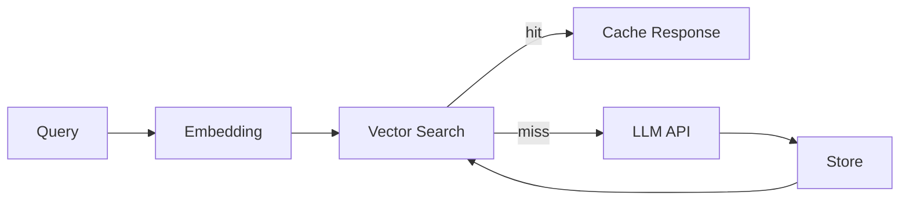

## ¿Qué es el Caché Semántico?

A diferencia del caché tradicional (key-value exacto), el caché semántico almacena respuestas basándose en la **similitud semántica** de las consultas, no en coincidencias exactas.

## ¿Por qué usarlo?

| Beneficio | Descripción |
|-----------|-------------|
| **Reducción de costos** | Menos llamados a APIs de LLM |
| **Menor latencia** | Respuestas instantáneas para queries similares |
| **Consistencia** | Misma respuesta para preguntas equivalentes |

## Arquitectura

## Componentes Clave

### 1. Modelo de Embeddings

Convierte texto en vectores numéricos que capturan el significado semántico.

**Opciones populares:**
- OpenAI `text-embedding-3-small` (1536 dims)
- Cohere `embed-english-v3.0`
- Sentence Transformers (open source)

### 2. Vector Store

Almacena los embeddings y permite búsqueda por similitud.

**Opciones:**
- **Redis Stack**: Con módulo de vectores
- **Pinecone**: Managed, escalable
- **Qdrant**: Open source, alto rendimiento
- **ChromaDB**: Simple, ideal para desarrollo

### 3. Threshold de Similitud

Define qué tan "parecidas" deben ser dos queries para considerarse equivalentes.

## Consideraciones

### Cuándo NO usar caché semántico

- Queries que requieren datos en tiempo real
- Preguntas sobre fechas/horas actuales
- Información que cambia frecuentemente
- Consultas muy específicas de usuario

### TTL (Time To Live)

## Métricas a Monitorear

1. **Hit Rate**: % de queries servidas desde caché
2. **Latencia P50/P95**: Tiempo de respuesta
3. **Similarity Distribution**: Histograma de scores de similitud
4. **Cache Size**: Memoria utilizada

## Recursos

- [GPTCache](https://github.com/zilliztech/GPTCache)
- [LangChain Caching](https://python.langchain.com/docs/modules/model_io/llms/llm_caching)
- [Redis Vector Similarity](https://redis.io/docs/stack/search/reference/vectors/)
