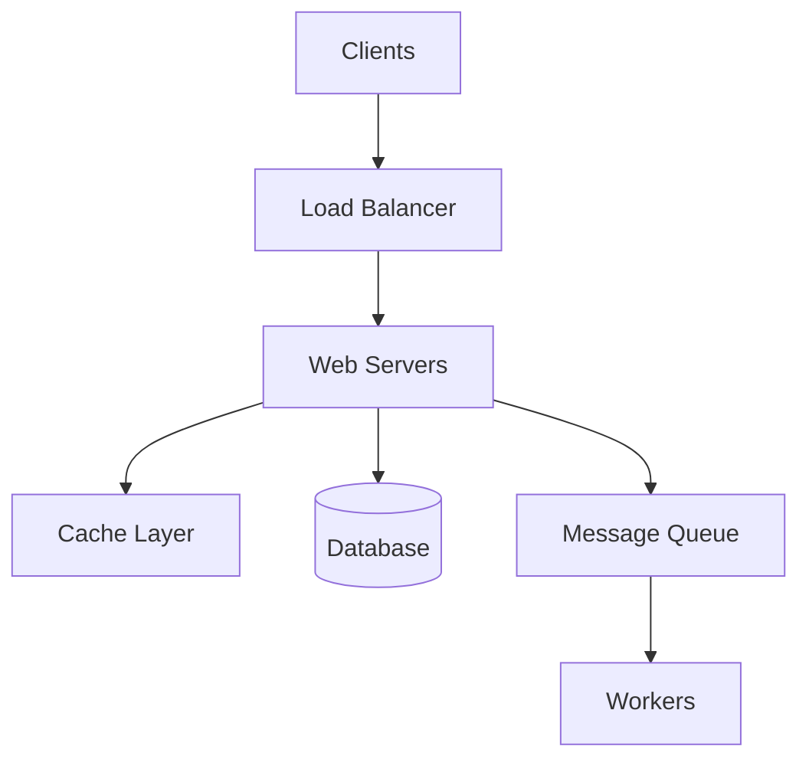
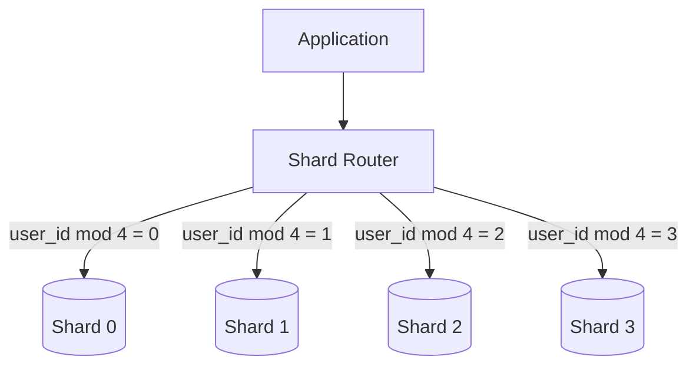
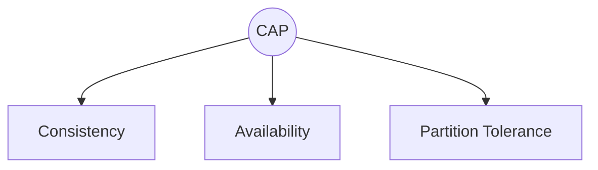

## Introducción

Notas del libro **"System Design Interview"** de Alex Xu. Este libro es una referencia excelente para entender cómo diseñar sistemas a escala.

## Framework para System Design

### 1. Entender el Problema (5-10 min)

Preguntas clave:
- ¿Cuáles son las features principales?
- ¿Cuántos usuarios?
- ¿Cuál es la escala esperada?
- ¿Qué restricciones existen?

### 2. Proponer Diseño de Alto Nivel (10-15 min)

### 3. Diseño Detallado (10-25 min)

Profundizar en componentes críticos según los requisitos.

### 4. Wrap-up (3-5 min)

- Identificar bottlenecks
- Proponer mejoras futuras

## Conceptos Fundamentales

### Escalabilidad Vertical vs Horizontal

| Aspecto | Vertical | Horizontal |
|---------|----------|------------|
| Definición | Más recursos a un servidor | Más servidores |
| Límite | Hardware máximo | Virtualmente ilimitado |
| Costo | Exponencial | Lineal |
| Complejidad | Baja | Alta |
| Downtime | Requerido | No requerido |

### Load Balancing

Distribuye tráfico entre múltiples servidores.

**Algoritmos comunes:**
- Round Robin
- Least Connections
- IP Hash
- Weighted Round Robin

### Caching

> "There are only two hard things in Computer Science: cache invalidation and naming things." - Phil Karlton

**Estrategias de invalidación:**
1. **TTL (Time To Live)**: Expira después de X tiempo
2. **Write-through**: Actualiza cache al escribir
3. **Write-behind**: Actualiza cache, escribe DB async
4. **Cache-aside**: App maneja cache manualmente

### Database Sharding

Distribuir datos entre múltiples bases de datos.

**Consideraciones:**
- Resharding complexity
- Celebrity problem (hot shards)
- Join queries across shards

## Números que Todo Desarrollador Debe Saber

| Operación | Latencia |
|-----------|----------|
| L1 cache reference | 0.5 ns |
| L2 cache reference | 7 ns |
| RAM reference | 100 ns |
| SSD random read | 150 μs |
| HDD seek | 10 ms |
| Network round trip (same datacenter) | 500 μs |
| Network round trip (cross-continent) | 150 ms |

## CAP Theorem

En un sistema distribuido, solo puedes garantizar 2 de 3:

- **CA**: Bases de datos tradicionales (RDBMS)
- **CP**: MongoDB, Redis, HBase
- **AP**: Cassandra, DynamoDB, CouchDB

## Recursos

- System Design Interview - Alex Xu
- Designing Data-Intensive Applications - Martin Kleppmann
- [System Design Primer](https://github.com/donnemartin/system-design-primer)
